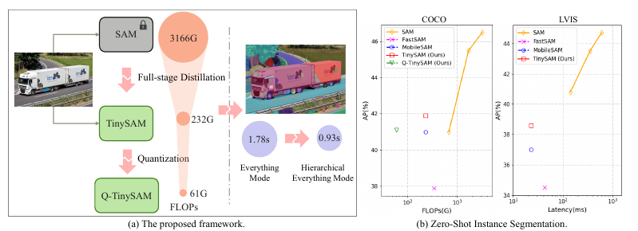

# Contents

- [Contents](#contents)
    - [TinySAM Description](#tinysam-description)
    - [Framework](#framework)
    - [Environment Requirements](#environment-requirements)
    - [Script description](#script-description)
        - [Script and sample code](#script-and-sample-code)
    - [Eval process](#eval-process)
        - [Usage](#usage)
        - [Launch](#launch)
        - [Result](#result)
    - [ModelZoo Homepage](#modelzoo-homepage)

## [TINY-SAM Description](#contents)

We first propose a full-stage knowledge distillation method with online hard prompt sampling strategy to distill a lightweight student model. We also adapt the post-training quantization to the promptable segmentation task and further reducing the computational cost. Moreover, a hierarchical segmenting everything strategy is proposed to accelerate the everything inference by with almost no performance degradation. With all these proposed methods, our TinySAM leads to orders of magnitude computational reduction and pushes the envelope for efficient segment anything task. Extensive experiments on various zero-shot transfer tasks demonstrate the significantly advantageous performance of our TinySAM against counterpart methods.

## [Framework](#contents)

The proposed framework and zero-shot instance segmentation results are shown below:



## [Environment Requirements](#contents)

- Hardware(Ascend/GPU)
    - Prepare hardware environment with Ascend or GPU.
- Framework
    - [MindSpore](https://www.mindspore.cn/install/en) >= 2.2
- For more information, please check the resources below
    - [MindSpore Tutorials](https://www.mindspore.cn/tutorials/en/master/index.html)
    - [MindSpore Python API](https://www.mindspore.cn/docs/en/master/api_python/mindspore.html)

## [Script description](#contents)

### [Script and sample code](#contents)

```text

SNN-MLP
├── demo.py # demo entry
├── fig
│   ├── picture1.jpg # demo picture
│   └── tinysam.png # the illustration of the framework of tinysam
├── README.md # Readme
└── tinysam # source code of tinySAM

```

## [Eval process](#contents)

### Usage

After installing MindSpore via the official website, you can start evaluation as follows:

### Launch

```bash

# infer example
  python demo.py #CPU

```

## [ModelZoo Homepage](#contents)

Please check the official [homepage](https://gitee.com/mindspore/models).