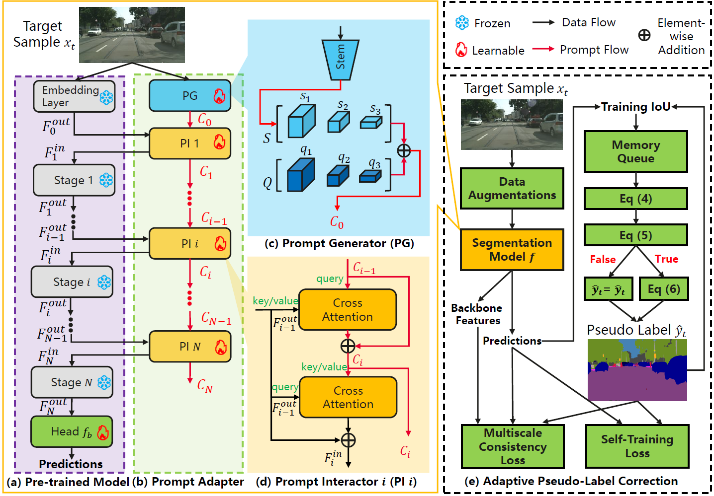

# When Visual Prompt Tuning Meets Source-Free Domain Adaptive Semantic Segmentation

## Introduction

Source-free domain adaptive semantic segmentation aims to adapt a pre-trained source model to the unlabeled target domain without accessing the private source data. Previous methods usually fine-tune the entire network, which suffers from expensive parameter tuning. To avoid this problem, we propose to utilize visual prompt tuning for parameter-efficient adaptation. However, the existing visual prompt tuning methods are unsuitable for source-free domain adaptive semantic segmentation due to the following two reasons: (1) Commonly used visual prompts like input tokens or pixel-level perturbations cannot reliably learn informative knowledge beneficial for semantic segmentation. (2) Visual prompts require sufficient labeled data to fill the gap between the pre-trained model and downstream tasks. To alleviate these problems, we propose a universal unsupervised visual prompt tuning (Uni-UVPT) framework, which is applicable to various transformer-based backbones. Specifically, we first divide the source pre-trained backbone with frozen parameters into multiple stages, and propose a lightweight prompt adapter for progressively encoding informative knowledge into prompts and enhancing the generalization of target features between adjacent backbone stages. Cooperatively, a novel adaptive pseudo-label correction strategy with a multiscale consistency loss is designed to alleviate the negative effect of target samples with noisy pseudo labels and raise the capacity of visual prompts to spatial perturbations.



## Setup and Environments

Please install the requirements with:

```shell
pip install -r requirements.txt
```

## Datasets

**Cityscapes:** Download leftImg8bit_trainvaltest.zip and
gt_trainvaltest.zip from [here](https://www.cityscapes-dataset.com/downloads/)
and extract them to `data/cityscapes`.

**Data Preprocessing:** Run the following scripts to convert the label IDs to the
train IDs:

```shell

python tools/convert_cityscapes.py data/cityscapes --nproc 8
```

## Evaluation

We provide testing scripts to evaluate GTA→Cityscapes task using Swin-Transformer.
Please manually download checkpoints from [baidu](https://pan.baidu.com/s/1YsgYQ-e3oBqvF6cyYpX8Og?pwd=hxyy) and [Google Drive](https://drive.google.com/drive/folders/16GqtIViAzzTdrsY3HotFk7ab5Vds4j1M?usp=sharing), and place them in `checkpoints/`.

Then test the whole method with:

```shell
sh eval.sh
```

## Results

| Model | Pretraining | GTA5 -> Cityscapes (mIoU19) | Synthia -> Cityscapes (mIoU16)|  Synthia -> Cityscapes (mIoU13) |
|:----:|:----------:|:----:|:----:|:----:|
Ours | Standard Single Source |56.2 | 52.6 | 59.4 |
Ours | Source-GtA |56.9| 53.8 | 60.4 |
